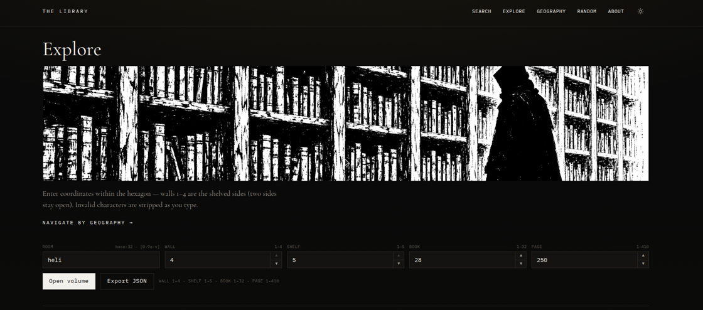
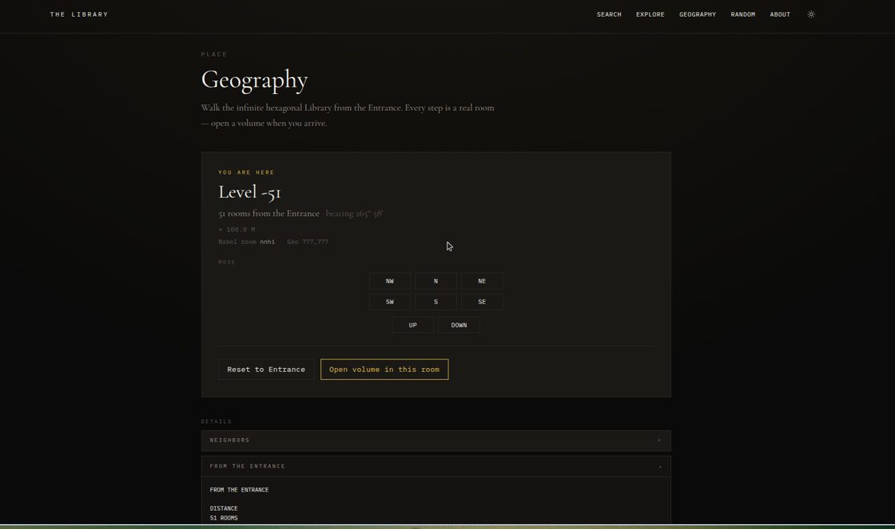
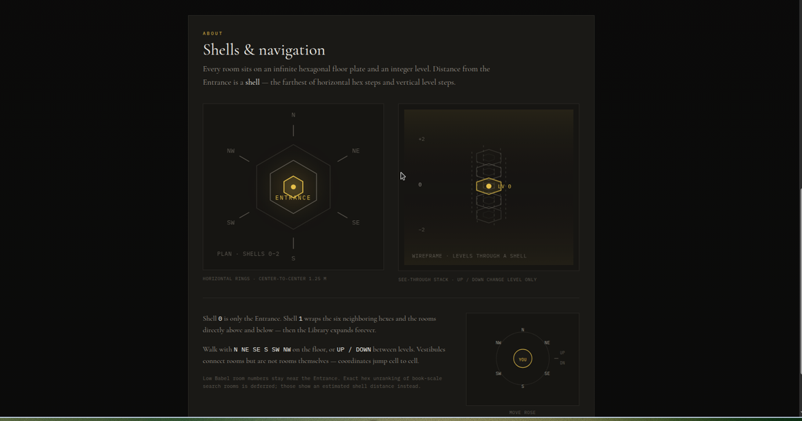

# The Library

An explorable recreation of Borges’ Library of Babel — every book that can be written with thirty-two characters already exists somewhere in the hexagons.

**Live coordinates.** Pages are computed, never stored. Search constructs a volume that contains your text and finds its address. Wander by shelf and page, or walk the infinite hexagonal floors level by level.

<p align="center">
  
</p>

<p align="center"><em>Browse any address in the hexagon — room · wall · shelf · book · page.</em></p>

## Wander

- **Search** — type a sentence; the engine locates a page that already holds it
- **Explore** — dial coordinates and open a volume in place
- **Geography** — walk hexagonal shells from the Entrance; every step is a real room
- **Random** — drop into a page somewhere in the lattice

<p align="center">
  
</p>

<p align="center"><em>Geography turns Babel room numbers into place — level, bearing, distance from the Entrance.</em></p>

<p align="center">
  
</p>

<p align="center"><em>Shells, levels, and the move rose — how the Library is laid out in space.</em></p>

## Stack

| Package | Role |
| --- | --- |
| `apps/web` | Vite + React + Tailwind + shadcn-style UI |
| `apps/api` | Hono — room hash store + static hosting |
| `packages/core` | BigInt math engine (browser worker + Node) |

Mathematics adapted from [tdjsnelling/babel](https://github.com/tdjsnelling/babel) (GPL-3.0). Interface and product copy are new. See `NOTICE` and `LICENSE`.

## Develop

```bash
npm install
npm run dev        # web on :5173 (proxies /api)
npm run dev:api    # API on :3000
npm test           # fast core tests
```

Open `http://localhost:5173`.

- Reader: `/book/1/wall/1/shelf/1/book/1/page/1`
- Search, Explore, Geography, Random, About in the nav

## Build & run

```bash
npm run build
npm start          # serves API + web dist on :3000
```

## License

GPL-3.0. See `LICENSE` and `NOTICE`.
